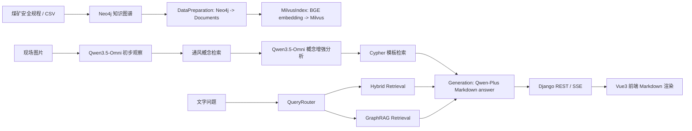

# 系统架构

## 目标

本项目将《煤矿安全规程》通风相关知识构建为 Neo4j 图谱和 Milvus 向量索引，并通过 RAG、Cypher 模板和 Qwen3.5-Omni 支持文字问答与现场图片隐患辨识。

## 顶层数据流

## 主要目录

| 路径 | 职责 |
|---|---|
| `agent/data_pipeline/` | Word/CSV 知识抽取与 Neo4j 入库流水线 |
| `agent/rag_system/` | 检索、路由、生成、VL 集成、Cypher 模板 |
| `agent/connection_manager.py` | Neo4j/Milvus 共享连接单例 |
| `web_backend/` | Django API、SSE、上传图片临时文件处理、Celery 占位 |
| `frontend/` | Vue3 + TypeScript + Pinia 对话前端 |
| `docs/grill-me-interview/` | 设计访谈和阶段计划记录 |

## RAG 核心模块

| 模块 | 当前职责 |
|---|---|
| `VentilationRAGPipeline` | 统一初始化连接、索引、检索、生成和图片入口 |
| `VentilationDataPreparationModule` | 从 Neo4j 读取图谱内容并转换为 LangChain `Document` |
| `VentilationMilvusIndexConstruction` | 将文档嵌入并写入 Milvus collection |
| `VentilationHybridRetrieval` | Milvus 向量检索 + Neo4j 图关键词检索 |
| `VentilationGraphRAGRetrieval` | LLM 意图解析 + 多跳图遍历检索 |
| `VentilationQueryRouter` | 根据问题复杂度选择 hybrid / graph / combined |
| `VentilationCypherTemplateEngine` | 根据结构化字段匹配和执行确定性 Cypher 模板 |
| `VentilationConceptRetriever` | 从 Neo4j/Milvus/内置兜底概念中检索通风概念定义卡片 |
| `VentilationVisionExtractor` | Qwen3.5-Omni 初步观察、概念检索、概念增强分析和结构化字段抽取 |
| `VentilationGeneration` | 根据检索文档、图片观察结果和概念卡片生成 Markdown 格式回答 |

## 图片识别链路

图片请求固定走串行流程，并在 SSE 中向前端输出步骤进度：

1. Django 保存上传图片到 `web_backend/media/` 临时文件。
2. `VentilationVisionExtractor.observe()` 先做低温初步观察，输出原始观察、不确定概念和关键线索。
3. `VentilationConceptRetriever` 根据不确定概念和观察文本检索概念卡片；可用 Neo4j `Concept`、Milvus `ventilation_concepts`，否则使用内置高频通风概念兜底。
4. `VentilationVisionExtractor.analyze_with_concepts()` 把概念定义注入第二轮 Qwen3.5-Omni prompt，输出场景、结构化字段、风险等级、主要隐患和关键观察。
5. `VentilationCypherTemplateEngine` 优先用结构化字段执行参数化 Cypher。
6. 文档不足时用图片描述、风险和关键观察走 hybrid 检索兜底。
7. 生成模块输出 Markdown 辨识报告。
8. Django 删除临时图片文件。

## Web 层

Django 不在 app 启动时立即加载 RAG，而是通过 `web_backend/chat/pipeline_service.py` 懒加载单例 `VentilationRAGPipeline`。第一次问答会触发初始化，后续请求复用同一 pipeline。

前端用 Vite 代理 `/api` 到 `127.0.0.1:8000`。助手消息使用 `markdown-it` 渲染 Markdown，并关闭原始 HTML。

图片流式请求除 `status`、`token`、`done`、`error` 外，还会接收 `step` 事件。前端将 `vision_observe`、`concept_search`、`vision_analyze`、`cypher_match`、`generating` 显示为可折叠 Agent 步骤，避免长时间图片分析时用户只看到静态“正在生成”。

## 前端用户模块

前端路由由 `frontend/src/router/index.ts` 管理：

| 路由 | 作用 |
|---|---|
| `/` | 重定向到 `/chat` |
| `/chat` | 主辨识对话页 |
| `/chat/:conversationId` | 指定会话页 |
| `/stats` | 会话统计和 JSON 导出 |
| `/settings` | 本地偏好设置 |

用户层状态集中在 `frontend/src/stores/chat.ts`。Pinia store 管理 `Conversation` 列表、当前会话、发送状态、搜索词、简易用户身份、偏好设置和账号同步状态。持久化采用账号作用域 key：游客写入 `localStorage` key `ventilation-graph-rag:user-module:v2:guest`，登录用户写入 `ventilation-graph-rag:user-module:v2:user:<userId>`，旧 `ventilation-graph-rag:user-module:v1` 仅作为游客迁移兼容。未登录时保持本地优先；已有账号登录只加载该账号本地缓存和后端会话，注册新账号时才把游客本地会话迁移到账号。发送状态、SSE 回写、输入草稿和待上传图片预览都按 `conversationId` 隔离。

后端用户模块位于 `web_backend/users/`，使用 Django 内置 `User` 和 session 登录。`UserProfile` 保存昵称、头像文字和偏好设置，`Team` 和 `TeamMembership` 提供团队空间与 `owner/admin/member` 三档角色。`ConversationRecord` 以 `(user, client_id)` 唯一约束保存前端会话快照、归档状态、元数据和消息 JSON，并通过可空 `team` 外键表示个人空间或团队空间。`ConversationAttachment` 保存登录用户上传的图片附件，开发期文件落在 `web_backend/media/conversation_attachments/`，前端消息只保存附件引用。P5 起用户模块启用 Django CSRF、密码校验器、登录失败限流、session cookie 安全配置和 `SecurityEvent` 账号安全事件记录；生产部署仍需要正式数据库、反向代理、静态/media 托管和跨域策略评审。

`/settings` 是账号和团队管理入口。登录用户可创建团队、按用户名添加成员、调整 `admin/member` 角色、移除成员。会话归属不在设置页处理，而是在每个对话的三点菜单中通过“归属团队”子菜单显式选择。P4+ 不自动共享历史个人会话，避免加入团队后暴露旧记录。

团队会话浏览通过 `GET /api/users/teams/<teamId>/conversations/` 提供。前端把这些会话保存在独立的 `teamConversations` 状态中，侧边栏在“最近对话”下方显示可展开/收起的“团队对话”。打开别人创建的团队会话时进入只读浏览，不参与当前用户个人会话同步。

`/stats` 采用分层统计来源：游客模式使用当前 Pinia 会话快照本地统计；登录用户优先调用 `GET /api/users/stats/summary/?days=7`，从后端 `ConversationRecord` 聚合完成率、近 7 天趋势、风险等级分布和场景分布。P4 起统计页可在个人空间和团队空间之间切换；团队统计通过 `teamId` 参数聚合该团队所有成员显式分配到团队的会话。若后端统计加载失败，前端会保留当前浏览器本地统计作为降级展示。

侧边栏由 `Sidebar.vue`、`ConversationList.vue`、`ConversationItem.vue`、`UserMiniCard.vue` 等组件组成。它采用浅色 Gemini 风格：收缩态为图标轨，展开态包含新建对话、搜索、统计入口、未归档对话列表、可展开/收起的团队对话区、归档区、偏好设置和用户头像。单个会话的三点菜单支持归属团队、分享、归档、重命名、导出 PDF 和删除；团队归属子菜单通过 Teleport 固定在主菜单右侧，避免被侧边栏滚动容器裁剪。

设置页和统计页的下拉控件统一使用 `frontend/src/components/SettingsSelect.vue`。不要在这些位置回退到原生 `select`，因为浏览器/系统默认 option 样式无法稳定控制，且容易被页面头部按钮样式污染。

导出能力全部在浏览器侧完成：单会话 PDF 通过新窗口打印生成，助手 Markdown 会先用 `markdown-it` 渲染为排版后的 HTML；全量记录通过 JSON blob 下载。未登录游客仍使用压缩 data URL 保存图片预览；登录用户上传图片时会先写入后端附件，消息和会话快照只保存 media URL 与附件元数据，从而减少 `localStorage` 和后端会话 JSON 体积。附件上传失败时前端会降级为本地 data URL，保证当次辨识不被阻断。
