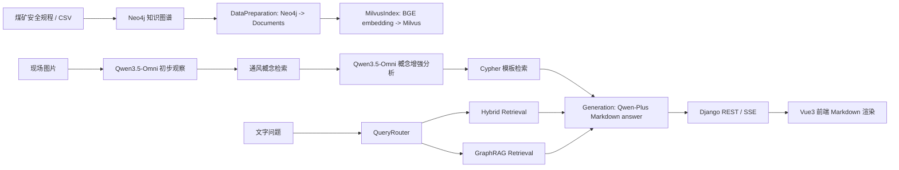

# 系统架构

## 目标

本项目将《煤矿安全规程》通风相关知识构建为 Neo4j 图谱和 Milvus 向量索引，并通过 RAG、Cypher 模板和 Qwen3.5-Omni 支持文字问答与现场图片隐患辨识。

## 顶层数据流

## 主要目录

| 路径 | 职责 |
|---|---|
| `agent/data_pipeline/` | Word/CSV 知识抽取与 Neo4j 入库流水线 |
| `agent/rag_system/` | 检索、路由、生成、VL 集成、Cypher 模板 |
| `agent/connection_manager.py` | Neo4j/Milvus 共享连接单例 |
| `web_backend/` | Django API、SSE、上传图片临时文件处理、Celery 占位 |
| `frontend/` | Vue3 + TypeScript + Pinia 对话前端 |
| `docs/grill-me-interview/` | 设计访谈和阶段计划记录 |

## RAG 核心模块

| 模块 | 当前职责 |
|---|---|
| `VentilationRAGPipeline` | 统一初始化连接、索引、检索、生成和图片入口 |
| `VentilationDataPreparationModule` | 从 Neo4j 读取图谱内容并转换为 LangChain `Document` |
| `VentilationMilvusIndexConstruction` | 将文档嵌入并写入 Milvus collection |
| `VentilationHybridRetrieval` | Milvus 向量检索 + Neo4j 图关键词检索 |
| `VentilationGraphRAGRetrieval` | LLM 意图解析 + 多跳图遍历检索 |
| `VentilationQueryRouter` | 根据问题复杂度选择 hybrid / graph / combined |
| `VentilationCypherTemplateEngine` | 根据结构化字段匹配和执行确定性 Cypher 模板 |
| `VentilationConceptRetriever` | 从 Neo4j/Milvus/内置兜底概念中检索通风概念定义卡片 |
| `VentilationVisionExtractor` | Qwen3.5-Omni 初步观察、概念检索、概念增强分析和结构化字段抽取 |
| `VentilationGeneration` | 根据检索文档、图片观察结果和概念卡片生成 Markdown 格式回答 |

## 图片识别链路

图片请求固定走串行流程，并在 SSE 中向前端输出步骤进度：

1. Django 保存上传图片到 `web_backend/media/` 临时文件。
2. `VentilationVisionExtractor.observe()` 先做低温初步观察，输出原始观察、不确定概念和关键线索。
3. `VentilationConceptRetriever` 根据不确定概念和观察文本检索概念卡片；可用 Neo4j `Concept`、Milvus `ventilation_concepts`，否则使用内置高频通风概念兜底。
4. `VentilationVisionExtractor.analyze_with_concepts()` 把概念定义注入第二轮 Qwen3.5-Omni prompt，输出场景、结构化字段、风险等级、主要隐患和关键观察。
5. `VentilationCypherTemplateEngine` 优先用结构化字段执行参数化 Cypher。
6. 文档不足时用图片描述、风险和关键观察走 hybrid 检索兜底。
7. 生成模块输出 Markdown 辨识报告。
8. Django 删除临时图片文件。

## Web 层

Django 不在 app 启动时立即加载 RAG，而是通过 `web_backend/chat/pipeline_service.py` 懒加载单例 `VentilationRAGPipeline`。第一次问答会触发初始化，后续请求复用同一 pipeline。

前端用 Vite 代理 `/api` 到 `127.0.0.1:8000`。助手消息使用 `markdown-it` 渲染 Markdown，并关闭原始 HTML。

图片流式请求除 `status`、`token`、`done`、`error` 外，还会接收 `step` 事件。前端将 `vision_observe`、`concept_search`、`vision_analyze`、`cypher_match`、`generating` 显示为可折叠 Agent 步骤，避免长时间图片分析时用户只看到静态“正在生成”。
